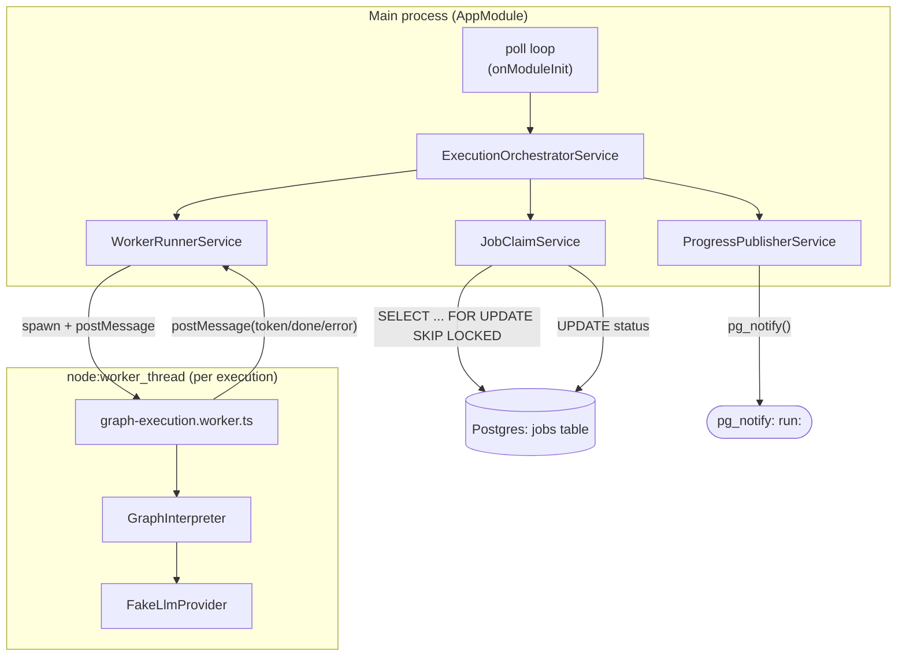

# Application Architecture

## Component overview

## Layers

- **`src/main.ts`** — bootstraps a NestJS *application context* (no HTTP server:
  `NestFactory.createApplicationContext`), enables shutdown hooks.
- **`src/app.module.ts`** — wires all providers via factory functions sharing one
  `createDb()`-produced pool/Drizzle instance, and owns the poll loop
  (`onModuleInit`/`onModuleDestroy`).
- **`src/orchestrator/execution-orchestrator.service.ts`** — coordinates one job's full
  lifecycle: claim → run worker → publish progress → complete/fail. The only class that spans
  the queue, worker, and progress layers.
- **`src/jobs/job-claim.service.ts`** — all `jobs` table reads/writes.
- **`src/worker/worker-runner.service.ts`** — spawns and manages the `worker_thread` lifecycle,
  exposing it as an `AsyncGenerator<WorkerMessage>`.
- **`src/worker/graph-execution.worker.ts`** — the worker-thread entry point; constructs a
  `GraphInterpreter` (with `FakeLlmProvider` hardcoded, see
  [`known-issues/index.md`](../known-issues/index.md)) and posts messages back to the parent.
- **`src/graph/graph-interpreter.ts`** — compiles a `GraphDefinition` into a
  `@langchain/langgraph` `StateGraph` and runs it.
- **`src/progress/progress-publisher.service.ts`** — publishes `WorkerMessage`s via
  `pg_notify`.
- **`src/db/client.ts`, `src/db/schema/public.ts`** — shared Postgres pool/Drizzle setup and
  schema, see [`data-architecture.md`](data-architecture.md).

## No HTTP surface

There are no NestJS controllers, REST endpoints, or WebSocket gateways in this project — it is a
headless worker process. All communication in and out is via the shared Postgres database (the
`jobs` table and `pg_notify`), per
[`business-architecture.md`](business-architecture.md).

## Concurrency model

One job is processed end-to-end at a time per engine instance (`processNext()` claims, runs, and
completes/fails before the poll loop claims again); running multiple engine instances scales
throughput horizontally since claiming is race-safe (see
[ADR-0002](ADR/0002-postgres-select-for-update-skip-locked-job-queue.md)). Within a single job,
execution is offloaded to a `worker_thread` (see
[ADR-0001](ADR/0001-worker-thread-isolation-for-graph-execution.md)) so the main thread stays
free to keep polling — though today's orchestrator still `await`s that worker to finish before
claiming the next job, so per-instance throughput is effectively serial regardless.
