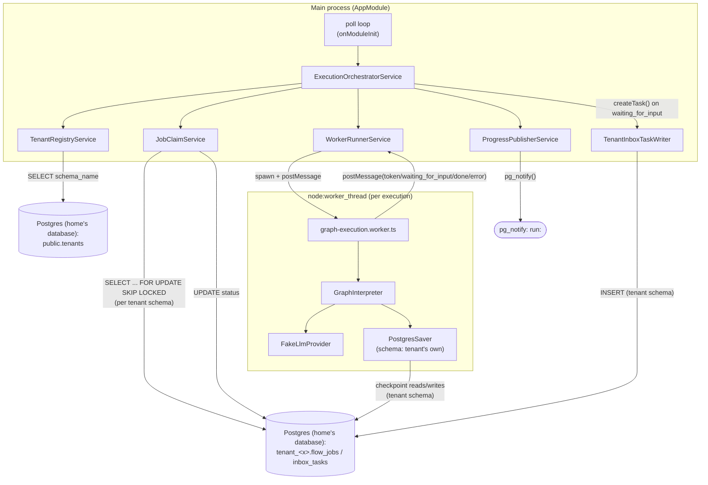

# Application Architecture

## Component overview

## Layers

- **`src/main.ts`** — bootstraps a NestJS *application context* (no HTTP server:
  `NestFactory.createApplicationContext`), enables shutdown hooks.
- **`src/app.module.ts`** — wires all providers via factory functions sharing one
  `createDb()`-produced pool/Drizzle instance (home's `public.tenants` + `pg_notify`) and one
  `TenantDbFactory` (per-tenant-schema connections), and owns the poll loop
  (`onModuleInit`/`onModuleDestroy`).
- **`src/orchestrator/execution-orchestrator.service.ts`** — coordinates one job's full
  lifecycle: discover a tenant with pending work → claim → run worker → publish progress →
  complete/fail (or write an inbox task and mark `waiting`). The only class that spans the tenant
  registry, queue, worker, and progress layers.
- **`src/tenants/tenant-registry.service.ts`** — lists tenant schema names from home's
  `public.tenants` table.
- **`src/db/tenantDb.ts`** (`TenantDbFactory`) — caches a small connection pool per tenant schema
  (`search_path` fixed per pool), mirroring home's own `getTenantDb()`.
- **`src/jobs/job-claim.service.ts`** — all `flow_jobs` reads/writes, scoped to whichever tenant
  schema is passed in.
- **`src/worker/worker-runner.service.ts`** — spawns and manages the `worker_thread` lifecycle,
  exposing it as an `AsyncGenerator<WorkerMessage>`.
- **`src/worker/graph-execution.worker.ts`** — the worker-thread entry point; constructs a
  `GraphInterpreter` (with `FakeLlmProvider` hardcoded, see
  [`known-issues/index.md`](../known-issues/index.md)) and a `PostgresSaver` scoped to the run's
  tenant schema, and posts messages back to the parent.
- **`src/graph/graph-interpreter.ts`** — compiles a `GraphDefinition` into a
  `@langchain/langgraph` `StateGraph` and runs it, walking an arbitrary multi-node graph (not
  just a single `llm` node) and dispatching `llm`/`form` node handlers.
- **`src/graph/inbox-task.port.ts`, `src/graph/tenant-inbox-task-writer.ts`** — the durable-inbox
  write boundary a `form` node's pause writes through; `TenantInboxTaskWriter` is the real,
  production implementation (`src/graph/fake-inbox-task-writer.ts` remains a test double).
- **`src/progress/progress-publisher.service.ts`** — publishes `WorkerMessage`s via
  `pg_notify`.
- **`src/db/client.ts`, `src/db/schema/public.ts`, `src/db/schema/tenant.ts`** — shared Postgres
  pool/Drizzle setup and hand-mirrored schema (both owned and migrated by home, not flow-engine —
  see [ADR-0005](ADR/0005-shared-multi-tenant-database.md)), plus [`data-architecture.md`](data-architecture.md).

## No HTTP surface

There are no NestJS controllers, REST endpoints, or WebSocket gateways in this project — it is a
headless worker process. All communication in and out is via the shared Postgres database (home's
`public.tenants`, each tenant's own `flow_jobs`/`inbox_tasks`, and `pg_notify`), per
[`business-architecture.md`](business-architecture.md).

## Concurrency model

One job is processed end-to-end at a time per engine instance (`processNext()` claims, runs, and
completes/fails before the poll loop claims again); running multiple engine instances scales
throughput horizontally since claiming is race-safe (see
[ADR-0002](ADR/0002-postgres-select-for-update-skip-locked-job-queue.md)). Within a single job,
execution is offloaded to a `worker_thread` (see
[ADR-0001](ADR/0001-worker-thread-isolation-for-graph-execution.md)) so the main thread stays
free to keep polling — though today's orchestrator still `await`s that worker to finish before
claiming the next job, so per-instance throughput is effectively serial regardless.

## Human-in-the-loop pause/resume

A `form` node's handler calls LangGraph's `interrupt()`, checkpointed via `PostgresSaver` (thread
id = the run's `runId`). The orchestrator reacts to this as a third outcome alongside
complete/fail: it writes an inbox task via `InboxTaskPort` and marks the job `waiting`. A `resume`
job later reloads the same checkpoint and continues — see
[ADR-0004](ADR/0004-langgraph-interrupt-resume-for-form-hitl-nodes.md).
