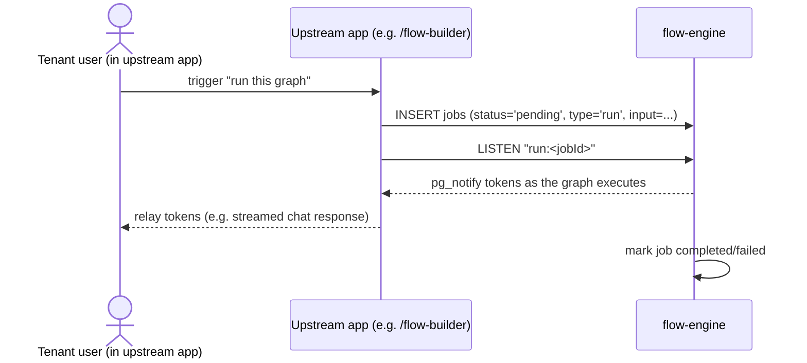

# Business Architecture

## Purpose

`flow-engine` executes tenant-authored LangGraph agent flows asynchronously and streams their
progress back, so an upstream application (e.g. `home`'s `/flow-builder`, formerly the
standalone `agent-builder`) can offer "run this graph" without hosting the execution runtime
itself.

## Capability

- Accept a queued execution request (`run` a graph, or — not yet implemented — `resume` one)
  scoped to a `tenantId`/`userId`/`graphId`.
- Execute a single-node LLM graph definition and report its result (`completed`/`failed`) back
  to the queue.
- Stream token-level progress for a run to any subscriber in real time.

## Actors

- **Upstream application** — enqueues `jobs` rows and subscribes to a run's `pg_notify` channel
  to relay progress to its own end users. `flow-engine` has no UI, API, or authentication of its
  own; it trusts whatever inserted the row.
- **Operator** — runs the `flow-engine` process itself (see
  [`user-guides/manual.md`](../user-guides/manual.md)); not a per-request actor.

There is no end-user-facing surface in this repository — the human actor (the person building or
running a flow) interacts entirely through the upstream application.

## Process flow

## Scope note

Multi-node graphs, the `resume` job type, and real (non-fake) LLM providers are not yet
implemented — see [`known-issues/index.md`](../known-issues/index.md) and
[`backlog.md`](../backlog.md). This document describes the capability as currently shipped.
