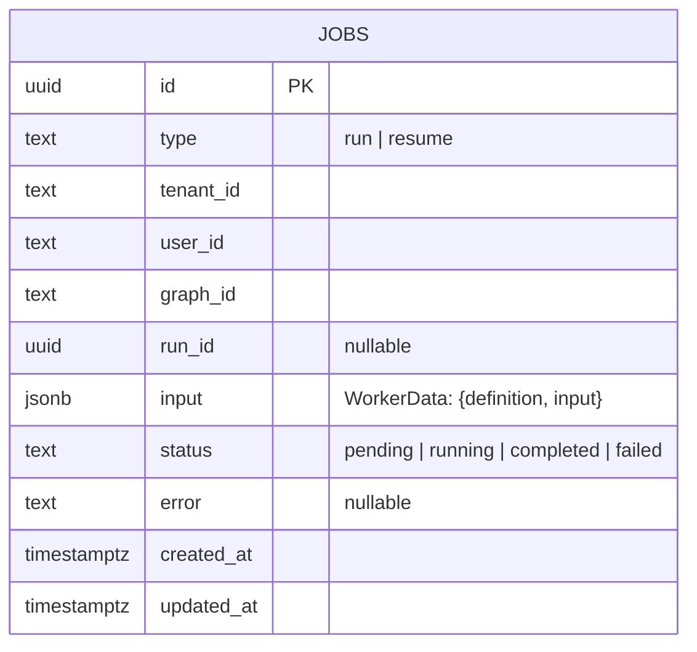

# Data Architecture

## Store

Single PostgreSQL 18 database, accessed through Drizzle ORM (`drizzle-orm/node-postgres`).
Schema is defined in `src/db/schema/public.ts` and versioned via `drizzle-kit`
(`npm run db:generate` / `npm run db:migrate`, see `drizzle.config.ts`).

## Entity: `jobs`

`jobs` is the only table. There are no foreign keys — `tenantId`/`userId`/`graphId`/`runId` are
opaque identifiers owned by the upstream application, not enforced references. An index on
`(status, created_at)` (`jobs_status_created_at_idx`) supports the claim query's
`WHERE status = 'pending' ORDER BY created_at` scan.

## Access pattern

`src/db/client.ts` creates one module-level `pg.Pool` + Drizzle instance (`createDb()`), shared
by `JobClaimService` and `ProgressPublisherService`, wired via `useFactory` providers in
`src/app.module.ts`. All job-state reads/writes go through `JobClaimService`
(`src/jobs/job-claim.service.ts`): `claimNext()` (race-safe claim, see
[ADR-0002](ADR/0002-postgres-select-for-update-skip-locked-job-queue.md)), `complete()`,
`fail()`.

## Ephemeral data: progress channel

Per-run progress (`token`/`done`/`error` messages) is not persisted to any table — it's
published transiently via `pg_notify('run:<jobId>', ...)` and is only observable by a client
`LISTEN`ing at publish time (see
[ADR-0003](ADR/0003-postgres-notify-for-progress-streaming.md)). The durable record of a run's
outcome is `jobs.status`/`jobs.error`; there is no token-level transcript stored anywhere.

## Graph definitions

`GraphDefinition` (`src/graph/graph-definition.types.ts`) — the graph a job executes — is not
stored by `flow-engine` at all. It arrives inline as part of `jobs.input` (`WorkerData`), owned
and persisted by the upstream application (e.g. `flow_builder_graphs` in `home`).
