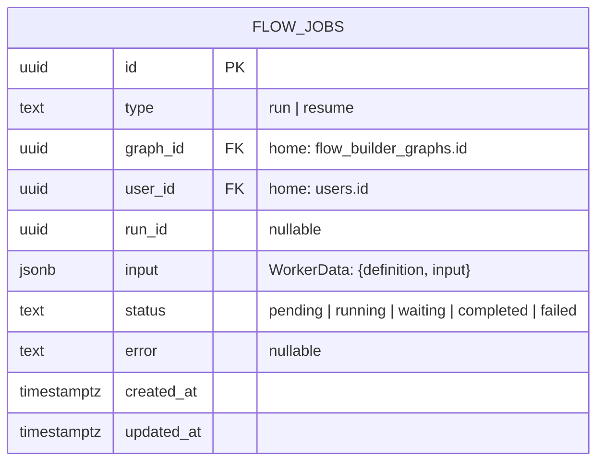

# Data Architecture

## Store

Single shared PostgreSQL 18 database — the same one `home` uses (see
[ADR-0005](ADR/0005-shared-multi-tenant-database.md)) — accessed through Drizzle ORM
(`drizzle-orm/node-postgres`). `flow-engine` owns and migrates nothing in this database: its own
`src/db/schema/public.ts` (`tenants`) and `src/db/schema/tenant.ts` (`flow_jobs`, `inbox_tasks`)
are hand-maintained mirrors of tables `home` owns and migrates. `flow-engine`'s own
`src/db/migrations/` (versioned via `drizzle-kit`, `npm run db:generate` / `npm run db:migrate`)
exist only for its own isolated dev/test Postgres instance (`docker-compose.yml`), which seeds a
minimal stand-in shape — not the production database.

## Entity: `flow_jobs` (per tenant schema)

`flow_jobs` lives inside each tenant's own Postgres schema — there is no cross-tenant table and no
`tenant_id` column; the tenant is implicit in which schema a row lives in. `graph_id`/`user_id` are
real foreign keys in home's schema (opaque identifiers as far as `flow-engine`'s own hand-mirrored
copy is concerned, since it doesn't enforce or care about the constraint itself).

## Entity: `inbox_tasks` (per tenant schema)

Durable record of a form node's paused, pending human input — written by
`TenantInboxTaskWriter` when a run hits a `waiting_for_input` outcome. `run_id` refers to the
`flow_jobs` row of the original `run`-type job (not necessarily the row currently `waiting` — see
`ExecutionOrchestratorService`). See home's `server/db/schema/tenant.ts` for the authoritative
column list.

## Access pattern

`src/db/client.ts`'s `createDb()` — one shared `pg.Pool` + Drizzle instance — is used only for
`public.tenants` reads (`TenantRegistryService`) and `pg_notify` progress publishing
(`ProgressPublisherService`); both are genuinely cross-tenant concerns. Everything else
(`flow_jobs`, `inbox_tasks`, LangGraph's own checkpoint tables) goes through `TenantDbFactory`
(`src/db/tenantDb.ts`), which caches a small connection pool per tenant schema (`search_path`
fixed per pool). `JobClaimService` (`src/jobs/job-claim.service.ts`) takes a `schemaName` on every
method: `claimNext()` (race-safe claim, see
[ADR-0002](ADR/0002-postgres-select-for-update-skip-locked-job-queue.md)), `complete()`,
`fail()`, `markWaiting()`.

## Ephemeral data: progress channel

Per-run progress (`token`/`done`/`error` messages) is not persisted to any table — it's
published transiently via `pg_notify('run:<jobId>', ...)` and is only observable by a client
`LISTEN`ing at publish time (see
[ADR-0003](ADR/0003-postgres-notify-for-progress-streaming.md)). `pg_notify` operates at the
database level, not per-schema, so this still works unchanged even though job rows themselves are
now per-tenant-schema. The durable record of a run's outcome is `flow_jobs.status`/`.error`; there
is no token-level transcript stored anywhere.

## Graph definitions

`GraphDefinition` (`src/graph/graph-definition.types.ts`) — the graph a job executes — is not
stored by `flow-engine` at all. It arrives inline as part of `flow_jobs.input` (`WorkerData`),
owned and persisted by `home` (`flow_builder_graphs`).
